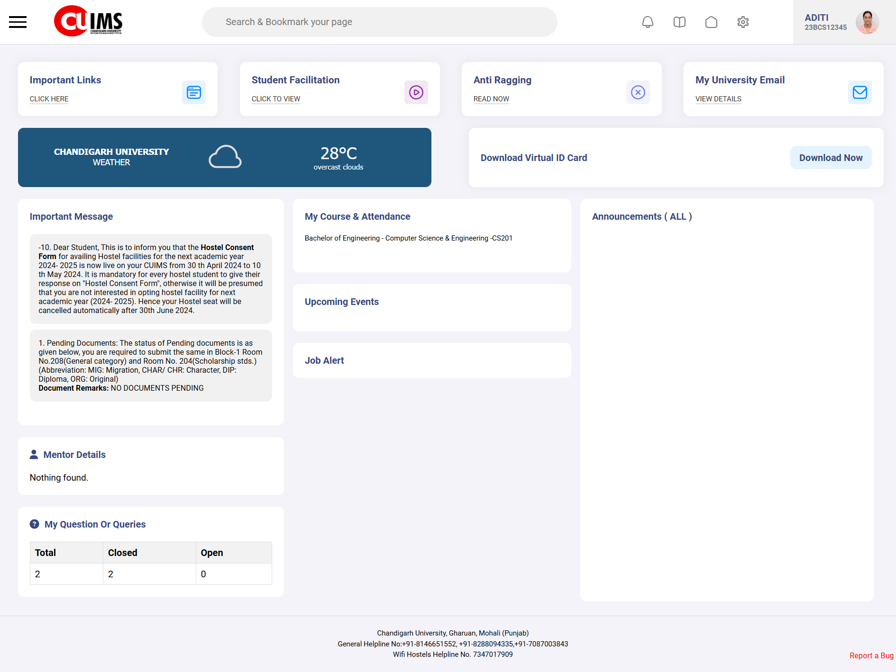

# CUIMS Clone

This project is a clone of the Chandigarh University Information Management System (CUIMS) website, created using HTML and CSS.

## Table of Contents
- [Overview](#overview)
- [Features](#features)
- [Installation](#installation)
- [Usage](#usage)
- [Screenshot](#screenshot)
- [Contributing](#contributing)

## Overview
The CUIMS Clone project replicates the basic design and layout of the Chandigarh University Information Management System website. This project is aimed at practicing and demonstrating skills in HTML and CSS.

## Features
- Navbar and footer
- Dashboard layout
- Basic styling mimicking the original website

## Installation
1. Clone the repository:
    ```sh
    git clone https://github.com/aditiarya37/cuims-clone.git
    ```
2. Navigate to the project directory:
    ```sh
    cd cuims-clone
    ```

## Usage
Open `index.html` in your preferred web browser to view the website.

## Screenshot


## Contributing
Contributions are welcome! Please create an issue or submit a pull request.

